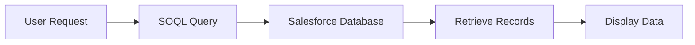
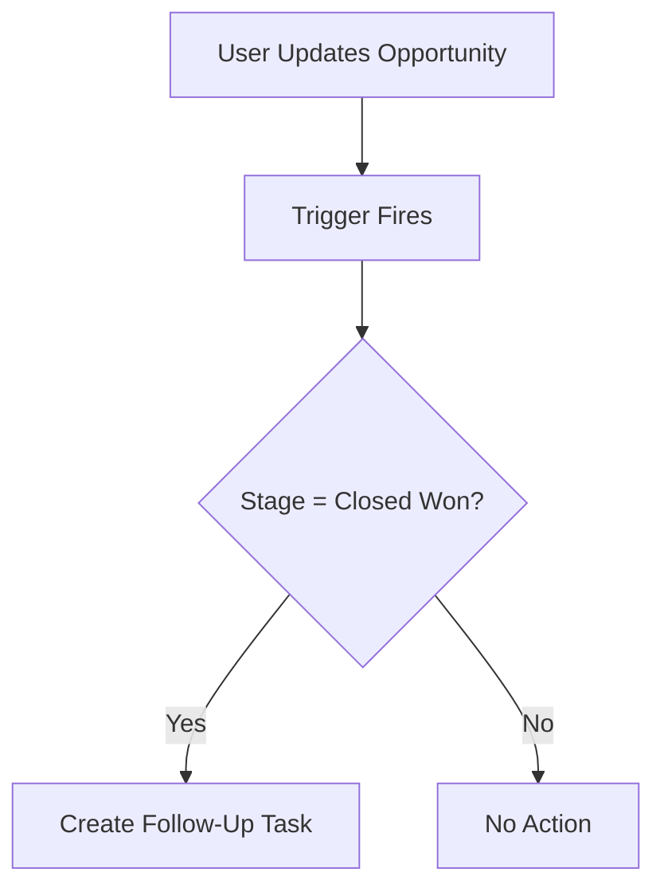
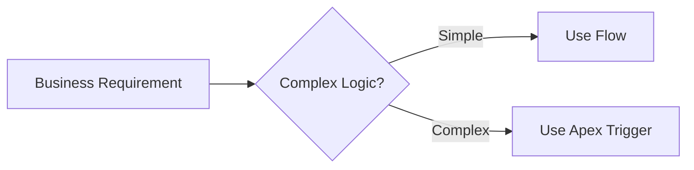
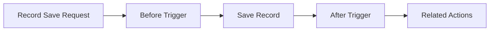
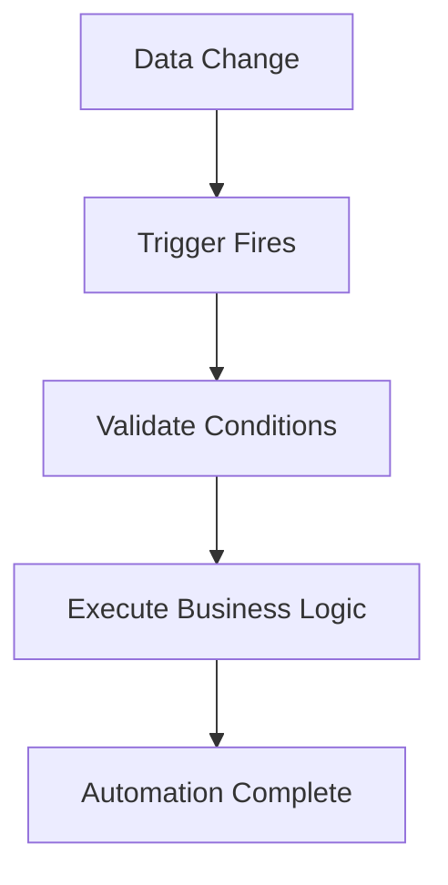
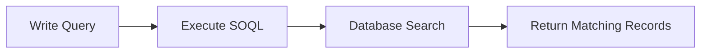
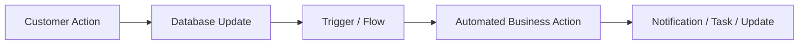
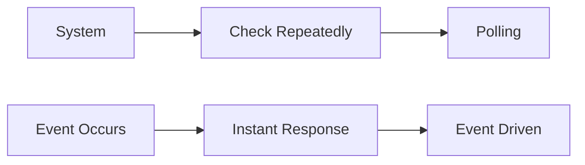

# Day 6 - SOQL & Apex Triggers

# 1. What is SOQL?

SOQL (Salesforce Object Query Language) is used to retrieve data from Salesforce objects.  
It is similar to SQL but designed specifically for Salesforce CRM data.

## SOQL Example

```sql
SELECT Name, Industry FROM Account
```

This query retrieves:
- Account Name
- Industry

from the Account object.

---

## SOQL Flowchart



---

## SOQL Architecture


---

# 2. What is an Apex Trigger?

An Apex Trigger is code that automatically executes when records are inserted, updated, deleted, or restored in Salesforce.

Triggers help automate backend business logic.

## Example
- Opportunity becomes **Closed Won**
- Automatically create a follow-up task

---

## Apex Trigger Flowchart



---

## Apex Trigger Image


---

# 3. Difference Between Concepts

# Flow vs Trigger

| Flow | Trigger |
|---|---|
| No-code / low-code automation | Code-based automation |
| Easier for admins | Used by developers |
| Best for simple logic | Best for complex logic |
| Built using Flow Builder | Written in Apex |
| Slower for heavy processing | Faster and more powerful |

---

## Flow vs Trigger Diagram



---

## Flow Builder Image


---

# Before Trigger vs After Trigger

| Before Trigger | After Trigger |
|---|---|
| Runs before saving record | Runs after saving record |
| Used to modify field values | Used for related records/actions |
| Faster because no extra save | Used when record ID is needed |
| Example: Update field values | Example: Create tasks |

---

## Before vs After Trigger Flowchart



---

## Trigger Lifecycle Image


---

# 4. Trigger Use Cases

## 1. Auto Create Follow-Up Tasks
When Opportunity stage becomes **Closed Won**, create a task automatically.

## 2. Sync Address Fields
Copy Billing Address to Shipping Address when checkbox is selected.

## 3. Prevent Invalid Data
Block users from saving records with incorrect values.

## 4. Send Notifications
Notify managers when high-value deals are created.

## 5. Update Related Records
When a Contact is updated, update related Account information.

---

## Trigger Use Case Flowchart



---

## CRM Automation Image


---

# 5. Query Examples (English Ideas)

| English Requirement | SOQL Query |
|---|---|
| Get all accounts | `SELECT Name FROM Account` |
| Find all contacts from Hyderabad | `SELECT Name FROM Contact WHERE MailingCity='Hyderabad'` |
| Get closed opportunities | `SELECT Name FROM Opportunity WHERE StageName='Closed Won'` |
| Show top customers | `SELECT Name, AnnualRevenue FROM Account` |
| Find recently created leads | `SELECT Name FROM Lead ORDER BY CreatedDate DESC` |

---

## Query Execution Flowchart



---

## Database Query Image


---

# 6. Reflection

Enterprise systems react automatically to data changes because businesses require:
- Real-time automation
- Faster workflows
- Reduced manual work
- Better data consistency
- Instant business actions

Triggers and automation tools help systems respond immediately whenever data changes occur.

## Example
- Customer places an order
- Inventory updates automatically
- Invoice gets generated
- Notification is sent instantly

This creates efficient and scalable enterprise systems.

---

## Enterprise Automation Flowchart



---

## Enterprise System Image


---

# Reflective Questions

# 1. Why do systems need triggers?

Triggers help systems react automatically to business events without human intervention.

---

# 2. Difference between polling and event-driven systems?

| Polling | Event-Driven |
|---|---|
| Continuously checks for updates | Reacts only when events occur |
| Slower and resource heavy | Faster and efficient |
| Wastes processing power | Better performance |

---

## Polling vs Event-Driven Flowchart



---

## Event Driven Architecture Image


---

# 3. Why are database queries important?

Queries help retrieve useful business data for reports, automation, dashboards, and decision-making.

---

# 4. When should Flows be preferred over Triggers?

Flows should be preferred when:
- Logic is simple
- No coding is needed
- Admins manage automation
- Faster development is required

---

# 5. What problems happen if automation logic becomes too complex?

Complex automation can cause:
- Slow performance
- Debugging difficulty
- Conflicts between automations
- Higher maintenance costs

---

# 6. Why should developers think carefully before automating actions?

Poor automation can:
- Create duplicate records
- Trigger infinite loops
- Affect system performance
- Cause incorrect business actions

Good automation should always be:
- Efficient
- Scalable
- Maintainable
- Secure

---

# Conclusion

SOQL and Apex Triggers are core Salesforce development concepts.  
They help enterprise applications automate workflows, process business events, and manage CRM data efficiently.
