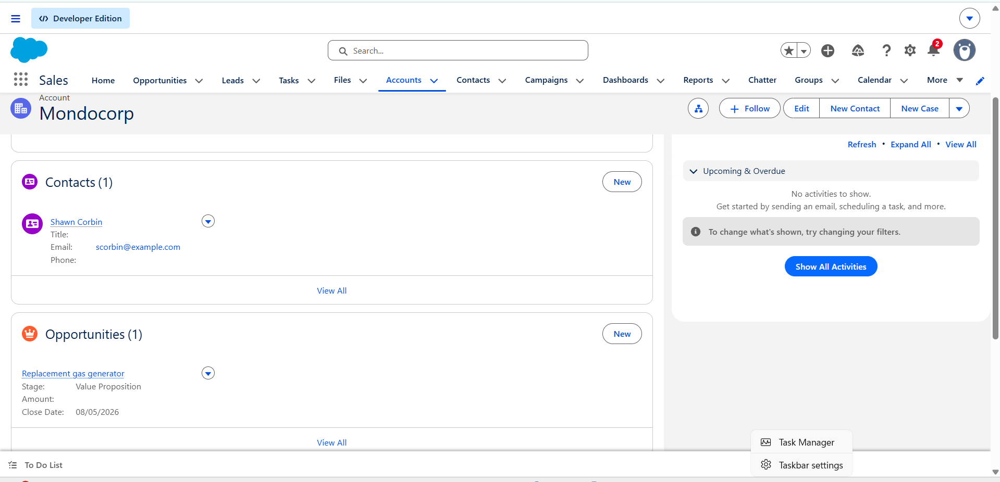
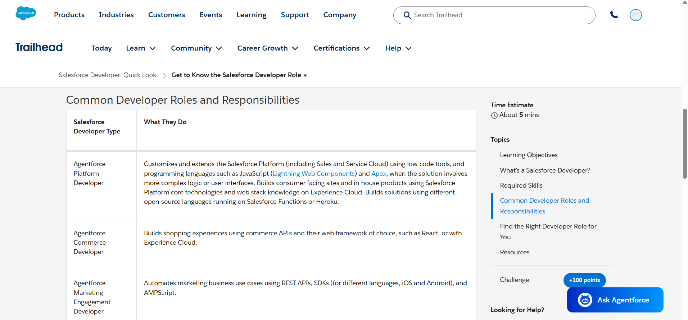
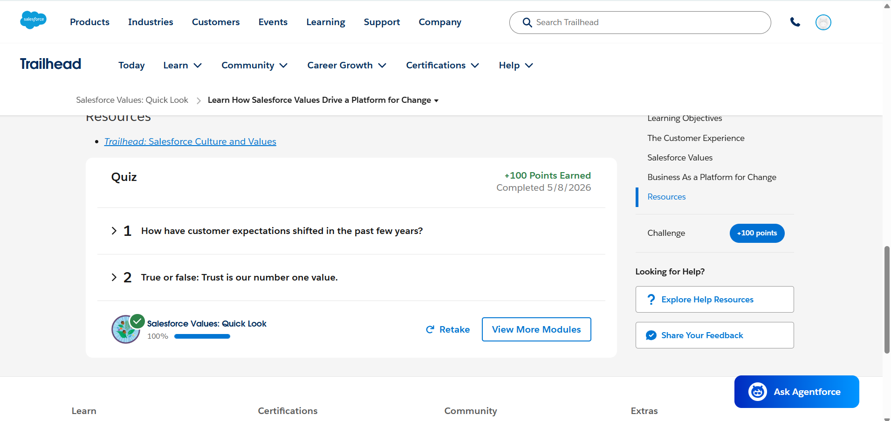

# Day 1 - Salesforce Basics

## Overview

Day 1 focused on understanding the fundamentals of Salesforce and Customer Relationship Management (CRM). The session covered the basic structure of Salesforce, how business data is organized, and the different roles involved in the Salesforce ecosystem.

The learning process mainly focused on understanding concepts rather than memorizing definitions.

---

## Learning Goal

The primary goal of Day 1 was to build a strong foundation in:

- Salesforce fundamentals
- CRM concepts
- Objects, records, and fields
- Business use cases of Salesforce
- Responsibilities of Salesforce Admins and Developers

---

## Topics Covered

During this session, the following topics were explored:

- Introduction to Salesforce
- Understanding CRM
- Why companies use Salesforce
- Salesforce objects, records, and fields
- Standard business processes in Salesforce
- Difference between Salesforce Admin and Salesforce Developer
- Real-world applications that can be built using Salesforce

---

# Submission Questions

## 1️⃣ What is CRM?

CRM stands for **Customer Relationship Management**.  
It is a system used by companies to manage customer data, communication, sales, and services in one place.

CRM helps businesses:
- Store customer information
- Track customer interactions
- Improve customer support
- Increase sales efficiency
- Build better customer relationships

One of the most popular CRM platforms is **Salesforce**.

---

## 2️⃣ Why Companies Use Salesforce

Companies use Salesforce because it helps them:
- Manage customer data efficiently
- Track sales opportunities
- Improve communication with customers
- Automate business processes
- Generate reports and analytics
- Increase productivity and sales

Salesforce is cloud-based, so employees can access data from anywhere.

---

# 3️⃣ Salesforce Objects

## 🔹 Account

An **Account** represents a company or organization.

### Examples:
- Infosys
- Amazon
- TCS

### It stores:
- Company name
- Industry
- Phone number
- Address

---

## 🔹 Contact

A **Contact** represents a person associated with an Account.

### Examples:
- Employee details
- Customer details
- Manager information

### It stores:
- Name
- Email
- Phone number
- Job title

---

## 🔹 Opportunity

An **Opportunity** represents a potential sales deal.

It helps companies track:
- Sales stage
- Expected revenue
- Closing date
- Deal status

### Example:
A company planning to buy software from Salesforce.

---

# 4️⃣ Real-World Mapping

| Real World | Salesforce Object |
|------------|------------------|
| College | Account |
| Student | Contact |
| Student Admission Process | Opportunity |

### Another Example

| Real World | Salesforce Object |
|------------|------------------|
| Company | Account |
| Employee/Customer | Contact |
| Business Deal | Opportunity |

---

---

# Repository Contents

This repository currently includes:

- `notes.md` → Detailed notes from Day 1
- `learnings.md` → Key concepts and takeaways
- `doubts.md` → Questions and clarification points
- `screenshots/` → Practical screenshots and references

---

# 📸 Screenshots

## Salesforce CRM

## Sales Developer Quick Look

## Sales Value Quick Look

# Overall Understanding

Day 1 provided a strong introduction to how Salesforce works as a CRM platform and how business data is structured using objects, records, and fields.

It also helped in understanding the practical roles of Salesforce professionals and how Salesforce can be used to build scalable real-world applications.

---

# Status

✅ Completed

