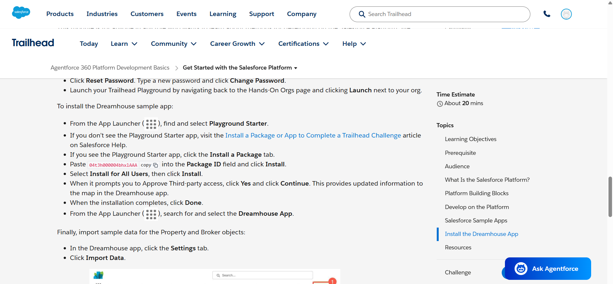
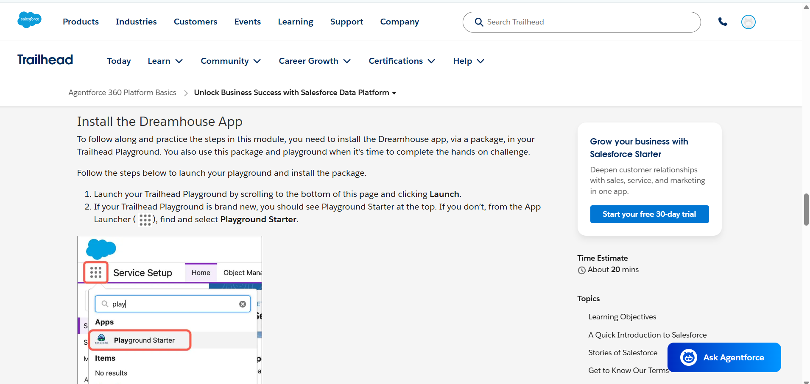

# Salesforce Platform Understanding and System Design

# 1. What is Salesforce Platform?

Salesforce is a cloud-based CRM (Customer Relationship Management) platform used by organizations to manage customers, sales, services, business processes, and automation in a centralized system.

Unlike traditional software, Salesforce works completely on the cloud, which means users can access it through the internet without installing software on local systems.

Salesforce provides:
- Data management
- Automation tools
- Application development
- Reporting and dashboards
- Security and user management
- Integration capabilities

The platform supports both:
- Configuration (No-Code / Low-Code)
- Custom Development using Apex and Lightning Components

Salesforce is widely used because it allows businesses to build scalable applications quickly while reducing infrastructure and maintenance costs.

---

# 2. Explain App, Object, and Tab

# What is an App?

An App in Salesforce is a collection of related tools, objects, tabs, reports, and dashboards grouped together for a specific business purpose.

Apps help users access all required functionalities from one place.

## Example
A Sales App may contain:
- Accounts
- Contacts
- Opportunities
- Reports
- Dashboards

This helps sales teams manage customer relationships efficiently.

---

# What is an Object?

An Object in Salesforce is similar to a database table that stores business data.

Objects contain:
- Fields (columns)
- Records (rows)

Every information stored in Salesforce is organized using objects.

## Example

### Student Object

| Student ID | Student Name | Department |
|---|---|---|
| 101 | Rahul | CSE |
| 102 | Priya | ECE |

Here:
- Student = Object
- Student ID, Student Name, Department = Fields
- Each row = Record

---

# Types of Objects

## Standard Objects
Provided by Salesforce.

Examples:
- Account
- Contact
- Opportunity
- Lead

## Custom Objects
Created according to business requirements.

Examples:
- Student
- Attendance
- Course

---

# What is a Tab?

A Tab is a navigation component used to access objects, records, reports, dashboards, or other Salesforce features.

Tabs improve navigation and help users quickly open different sections of the application.

## Examples
- Accounts Tab
- Contacts Tab
- Reports Tab
- Dashboard Tab

Tabs are generally placed on the navigation bar inside Salesforce Apps.

---

# Relationship Between App, Object, and Tab

```text
App
 ├── Tabs
 │     └── Open Objects
 │            └── Store Records
```

---

# 3. Difference Between Configuration and Coding

Salesforce provides two approaches for building solutions:
- Configuration (No-Code)
- Coding (Apex Development)

---

# Configuration (No-Code)

Configuration means building applications using Salesforce’s built-in tools without writing programming code.

This approach is also called:
- Declarative Development
- Low-Code Development

## Common Tools
- Flow Builder
- Validation Rules
- Formula Fields
- Approval Processes
- Page Layouts

## When to Use Configuration
Configuration should be used when:
- The requirement is simple
- Salesforce already provides built-in functionality
- Faster development is required
- Easy maintenance is preferred

## Example
Automatically sending an email when a student record is created using Flow Builder.

---

# Coding (Apex)

Coding is used when requirements are too complex for standard Salesforce tools.

Salesforce developers mainly use:
- Apex
- Lightning Web Components (LWC)
- APIs

## When to Use Coding
Coding should be used when:
- Complex business logic is required
- External integrations are needed
- Advanced customization is required
- Declarative tools are not sufficient

## Example
Integrating Salesforce with an external payment gateway using Apex APIs.

---

# Configuration vs Coding Comparison

| Feature | Configuration | Coding |
|---|---|---|
| Development Type | No-Code | Programming |
| Complexity | Simple to Medium | Medium to Complex |
| Speed | Faster | Slower |
| Maintenance | Easier | Technical |
| Flexibility | Limited | High |

---

# 4. System Design

# System Name
## ScholarSync – College Management System

ScholarSync is a Salesforce-based College Management System developed to manage academic operations efficiently.

---

# App Name
## ScholarSync

The application centralizes:
- Student management
- Faculty management
- Attendance tracking
- Course management
- Examination records

---

# Objects Inside the App

| Object Name | Purpose |
|---|---|
| Student | Stores student details |
| Faculty | Stores faculty information |
| Course | Stores course details |
| Attendance | Tracks attendance |
| Examination | Stores exam results |
| Department | Manages departments |

---

# Example Object Structure

## Student Object Fields
- Student ID
- Student Name
- Email
- Department
- Year

## Course Object Fields
- Course Name
- Course Code
- Credits

---

# User Interaction with the System

## Students Can:
- View attendance
- Check examination results
- View courses

## Faculty Members Can:
- Update attendance
- Enter marks
- Manage course information

## Administrators Can:
- Add students and faculty
- Manage departments
- Generate reports and dashboards

---

# Salesforce Navigation Structure

```text
ScholarSync App
   ├── Students Tab
   ├── Faculty Tab
   ├── Courses Tab
   ├── Attendance Tab
   ├── Examination Tab
   ├── Departments Tab
   └── Reports Dashboard
```

---

# Benefits of the System

- Centralized academic management
- Organized student records
- Efficient attendance tracking
- Easy examination management
- Cloud-based accessibility

---

# 📸 Screenshots

## Salesforce Platform Basics Notes



---

## Salesforce Platform Image


---

# Questions for Evaluation

# 1. What is an App in Salesforce?

An App in Salesforce is a collection of related tabs, objects, reports, and dashboards grouped together for a specific business purpose. Apps help users access all required functionalities from one centralized location.

---

# 2. What is an Object?

An Object in Salesforce is similar to a database table used to store business data. Objects contain fields and records and are used to organize information inside Salesforce.

---

# 3. Difference Between App and Object

| App | Object |
|---|---|
| Collection of features | Stores data |
| Organizes functionalities | Organizes records |
| Contains tabs and objects | Contains fields and records |

---

# 4. What is Multi-Tenant Architecture?

Multi-tenant architecture means multiple organizations share the same Salesforce infrastructure and servers while keeping their data secure and isolated.

This helps reduce:
- Infrastructure cost
- Maintenance effort
- Software installation complexity

Each company gets its own secure environment called an Org.

---

# 5. When Should We Use Configuration Instead of Code?

Configuration should be used when Salesforce already provides built-in tools to solve the requirement.

It is preferred because:
- Development is faster
- Maintenance is easier
- Less technical complexity is involved

Examples:
- Validation Rules
- Flow Builder
- Approval Processes

---

# 6. How Does Salesforce Allow Developers to Extend Functionality?

Salesforce allows developers to extend functionality using:
- Apex Programming
- Lightning Web Components (LWC)
- APIs
- Integrations
- Custom Objects and Automation

These tools help developers build advanced business logic, custom interfaces, and external system integrations.
