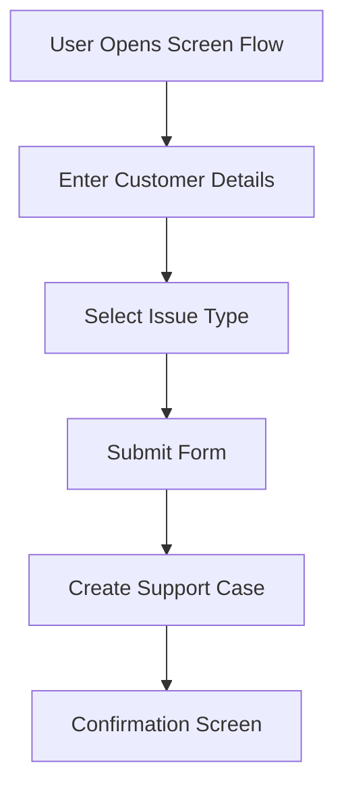
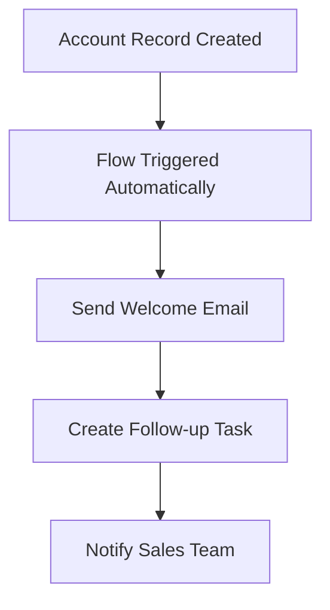
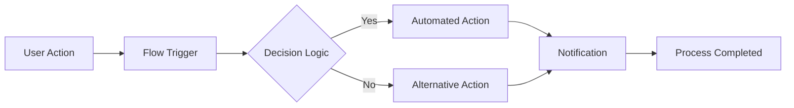
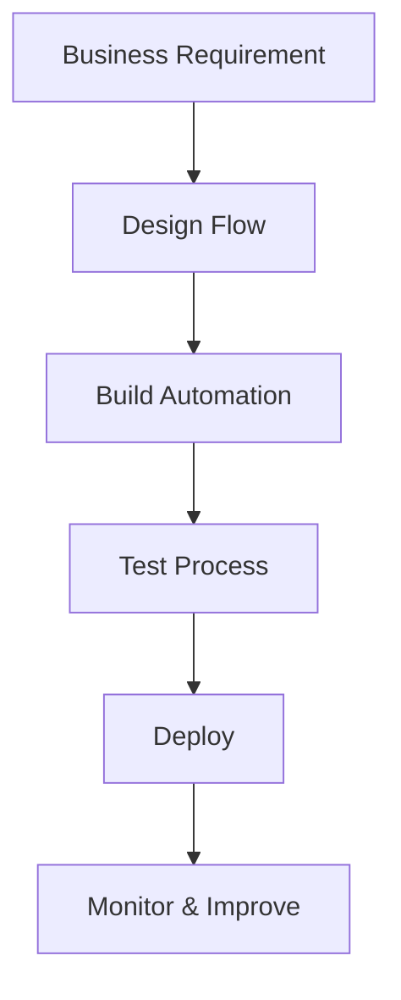

# Day 4 – Salesforce Flow Builder

## What is Flow Builder?

Salesforce Flow Builder is a **no-code/low-code automation tool** used to automate business processes inside the Salesforce platform. It allows users to create workflows visually using drag-and-drop components instead of writing large amounts of code.

Flow Builder helps organizations:

* Automate repetitive tasks
* Reduce manual work
* Improve productivity
* Maintain data consistency
* Guide users through business processes
* Trigger actions automatically based on events

---

# Types of Flows

Salesforce provides multiple types of flows for different business needs.

## 1. Screen Flow

A **Screen Flow** is an interactive flow that displays screens to users and collects information.

### Features

* User interaction through forms/screens
* Can collect user input
* Guides users step-by-step
* Used for approvals, registrations, support forms, onboarding, etc.

### Example

A customer support agent fills out a screen flow to create a support ticket.

### Screen Flow Diagram

### Suggested Image

)

---

## 2. Record Triggered Flow

A **Record Triggered Flow** runs automatically when a record is created, updated, or deleted.

### Features

* Fully automated
* No user interaction required
* Executes in the background
* Helps automate business logic instantly

### Example

When a new Account is created, Salesforce automatically sends a welcome email and creates a follow-up task.

### Record Triggered Flow Diagram

### Suggested Image

---

# Your Automation Ideas (5 Examples)

## 1. Student Admission Automation

When a student registration form is submitted:

* Create student record
* Send confirmation email
* Assign counselor automatically

---

## 2. Employee Onboarding Automation

When HR creates a new employee:

* Generate employee ID
* Assign training tasks
* Send welcome email
* Notify IT department

---

## 3. Inventory Alert Automation

When stock quantity becomes low:

* Send alert to manager
* Create purchase request
* Notify supplier team

---

## 4. Customer Support Automation

When a customer creates a complaint:

* Generate support case
* Assign priority level
* Notify support team
* Send customer acknowledgement email

---

## 5. Sales Follow-up Automation

When a lead status changes to “Interested”:

* Create follow-up task
* Schedule reminder
* Notify sales representative

---

# Flow Diagram

## Complete Automation Workflow

---

# Manual vs Automated Process

| Manual Process            | Automated Process      |
| ------------------------- | ---------------------- |
| Requires human effort     | Runs automatically     |
| Time-consuming            | Faster execution       |
| Higher chance of errors   | Improved accuracy      |
| Difficult to scale        | Easily scalable        |
| Inconsistent workflow     | Standardized workflow  |
| Requires repeated actions | One-time configuration |

---

# Reflection – Why Automation Matters in Enterprise Systems

Automation plays a critical role in modern enterprise systems because businesses handle thousands of operations every day. Manual processes consume time, increase errors, and reduce productivity.

With automation:

* Tasks are completed faster
* Employees focus on important work
* Customer experience improves
* Data becomes more accurate
* Business operations become scalable
* Organizations save time and operational cost

In enterprise systems like Salesforce, automation ensures that business rules are followed consistently across departments.

---

# Reflective Questions

## 1. Why do companies automate workflows?

Companies automate workflows to improve efficiency, reduce manual effort, save time, minimize errors, and increase productivity.

---

## 2. What problems happen with manual processes?

Manual processes can lead to:

* Human errors
* Delays
* Inconsistent data
* Reduced productivity
* Communication gaps
* Higher operational costs

---

## 3. Difference between Screen Flow and Record Triggered Flow?

| Screen Flow               | Record Triggered Flow       |
| ------------------------- | --------------------------- |
| Requires user interaction | Runs automatically          |
| Displays screens/forms    | No screens involved         |
| Used for guided processes | Used for backend automation |
| Started manually by user  | Triggered by record changes |

---

## 4. Why is no-code automation powerful?

No-code automation allows users to build business solutions without programming knowledge. This helps organizations develop faster, reduce dependency on developers, and quickly adapt to changing business requirements.

---

## 5. When should automation be avoided?

Automation should be avoided when:

* Processes change frequently
* Human judgment is critical
* The process is too complex
* Automation cost is higher than benefits
* Security or compliance risks exist

---

## 6. How does automation improve consistency and productivity?

Automation follows predefined rules every time, ensuring consistency. It reduces repetitive work, speeds up execution, minimizes mistakes, and allows employees to focus on strategic tasks.

---

# Additional Visual References

## Salesforce Flow Builder Interface

## Automation Lifecycle

---

# Conclusion

Salesforce Flow Builder is one of the most powerful automation tools available in the Salesforce ecosystem. It enables organizations to automate workflows efficiently without extensive coding knowledge.

By using Screen Flows and Record Triggered Flows, businesses can improve productivity, maintain consistency, and build scalable enterprise systems.
