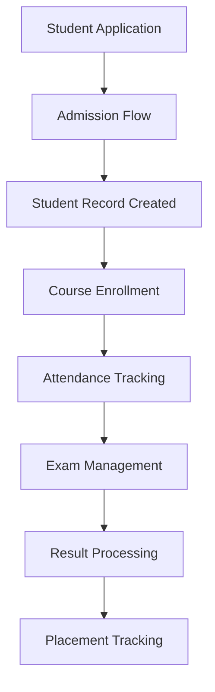
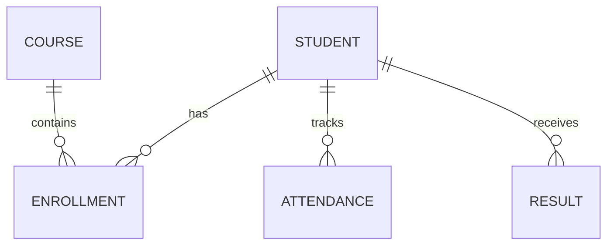

# Salesforce Development: Declarative vs Programmatic 🚀

This repository explains the difference between Salesforce declarative tools (Flow/Configuration) and programmatic development (Apex) using a College Management System as a case study.

---

# Table of Contents

1. What is Apex?
2. Flow vs Apex
3. Configuration vs Coding
4. Real Examples Where Apex is Needed
5. College Management System Design
6. Pseudocode Examples
7. Reflection Questions
8. Conclusion

---

# 1. What is Apex?

Apex is Salesforce’s object-oriented programming language used to implement custom business logic and backend automation.

### Features of Apex

- Similar to Java
- Runs on Salesforce servers
- Supports triggers and classes
- Handles complex business logic
- Supports API integrations
- Used for enterprise-scale automation

---

# 2. Flow vs Apex

| Feature | Flow | Apex |
|---|---|---|
| Type | No-code / Low-code | Programming |
| Interface | Visual Builder | Code Editor |
| Complexity Handling | Moderate | Advanced |
| Performance | Good | Excellent |
| Bulk Processing | Limited | Strong |
| Integrations | Basic | Advanced |
| Maintenance | Easier | Requires developers |

---

# Configuration vs Coding

| Configuration | Coding |
|---|---|
| Click-based development | Programmatic development |
| Faster setup | More flexible |
| Admin friendly | Developer friendly |
| Limited customization | Highly customizable |
| Best for standard automation | Best for complex logic |

---

# 3. Real Examples Where Apex is Needed

## 1. Scholarship Eligibility Engine

Used for:

- GPA calculations
- Attendance analysis
- Income-based filtering
- Ranking students

## 2. Payment Gateway Integration

Used for:

- REST API integration
- Payment verification
- Invoice generation
- Transaction processing

## 3. Timetable Conflict Detection

Used for:

- Faculty overlap checks
- Room conflict validation
- Schedule optimization

---

# 4. College Management System Design

## CRM Usage

Salesforce CRM manages:

- Student admissions
- Attendance
- Fees
- Courses
- Examinations
- Placements
- Scholarships

---

# Objects Used

| Object | Purpose |
|---|---|
| Student__c | Student information |
| Course__c | Course details |
| Enrollment__c | Student-course mapping |
| Attendance__c | Attendance records |
| Fee__c | Fee management |
| Result__c | Exam results |

---

# Relationships

```text
Department__c
    |
    |--< Course__c
            |
            |--< Enrollment__c >-- Student__c
                    |
                    |--< Attendance__c
                    |--< Result__c
                    |--< Fee__c
```

---

# Validation Rules

## Student Age Validation

```text
Age must be greater than 16
```

Formula:

```text
Age__c < 16
```

## Attendance Validation

```text
Attendance percentage cannot exceed 100
```

Formula:

```text
Attendance_Percentage__c > 100
```

---

# Flow Automation

## Admission Flow

1. Student submits application
2. Record gets created
3. Confirmation email sent
4. Fee record generated

## Attendance Alert Flow

1. Attendance updated
2. Flow checks percentage
3. If attendance < 75%
4. Warning email sent

---

# Apex Usage

## Scholarship Engine

Used for:

- Eligibility calculation
- Ranking logic
- Dynamic rules

## Payment Integration

Used for:

- API communication
- Transaction validation
- Payment confirmation

---

# System Flowchart



---

# ER Diagram



---

# 5. Pseudocode Examples

## Scholarship Eligibility

```text
START

IF attendance >= 85
AND marks >= 75
THEN
    scholarship = approved
ELSE
    scholarship = rejected
END IF

END
```

---

## Attendance Warning System

```text
START

FOR each student
    calculate attendance percentage

    IF attendance < 75
        send warning email
    END IF
END FOR

END
```

---

# Sample Apex Trigger

```java
trigger AttendanceAlert on Attendance__c (after insert, after update) {

    for(Attendance__c att : Trigger.new){

        if(att.Attendance_Percentage__c < 75){

            Messaging.SingleEmailMessage mail =
                new Messaging.SingleEmailMessage();

            mail.setToAddresses(
                new String[]{'student@example.com'}
            );

            mail.setSubject('Attendance Warning');

            mail.setPlainTextBody(
                'Your attendance is below 75%.'
            );

            Messaging.sendEmail(
                new Messaging.SingleEmailMessage[]{mail}
            );
        }
    }
}
```

---

# 6. Reflection Questions

## Why is Apex needed if Salesforce already has Flows?

Flows are excellent for simple automation, but Apex is required for:

- Complex logic
- Large data processing
- API integrations
- Advanced validations

---

## When should developers prefer no-code solutions?

Developers should prefer no-code when:

- Requirements are simple
- Fast deployment is needed
- Standard automation is sufficient

---

## What problems require custom programming?

- External integrations
- Complex calculations
- Enterprise-scale processing
- Real-time validations

---

## Why is business logic important?

Business logic ensures:

- Data consistency
- Process automation
- Reduced manual errors
- Standardized workflows

---

## Why avoid unnecessary coding?

Unnecessary coding increases:

- Maintenance cost
- Complexity
- Bug risks
- Technical debt

---

## How does programming increase flexibility?

Programming allows:

- Advanced customization
- Dynamic workflows
- Better integrations
- Scalable enterprise systems

---

# 7. Best Practices

- Prefer Flow before Apex
- Write bulkified Apex
- Avoid hardcoding
- Use reusable classes
- Write test classes
- Follow layered architecture

---

# 8. Conclusion

Salesforce provides powerful declarative tools like Flow for rapid automation. However, enterprise systems eventually require Apex programming for advanced business logic, integrations, scalability, and flexibility.

The best enterprise architecture combines:

- Configuration
- Flow Automation
- Apex Programming
- API Integrations
- Secure Business Logic

This hybrid approach creates scalable and maintainable enterprise applications.

---

