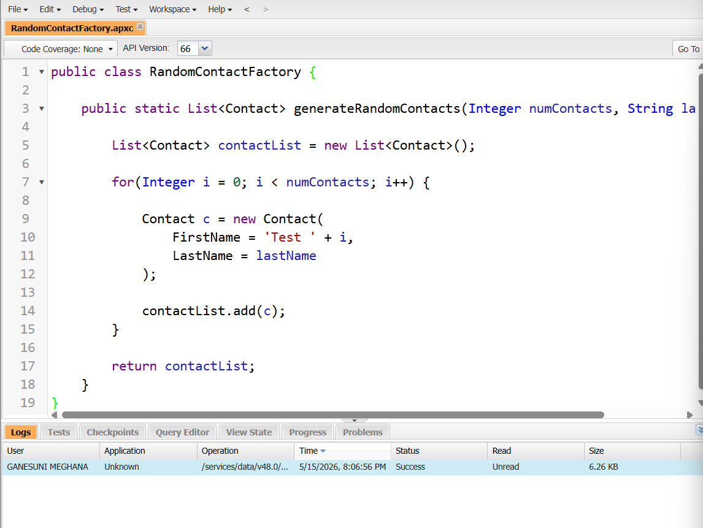
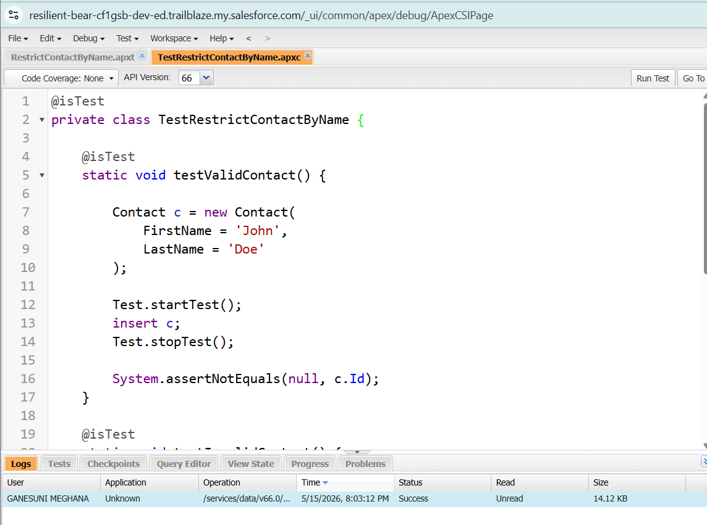

# Salesforce Summer Program – Day 7  
## Testing, Asynchronous Apex & Salesforce DX

---

# 🎯 Goal for Today

By the end of today, I understood:

- Why testing matters in enterprise systems
- What Asynchronous Apex is
- Why developers use Salesforce DX and CLI
- How professional Salesforce development workflow operates
- How all Salesforce concepts work together in one complete system

---

# ✅ Why Testing Matters

Testing is extremely important in enterprise applications because thousands or even millions of users depend on the system daily.

Without proper testing:
- Bugs can affect business operations
- Wrong data may be stored
- Automation may fail
- Reports may become inaccurate
- Users may lose trust in the system

Salesforce requires Apex code to have proper test coverage before deployment because reliability is critical in real-world business environments.

## Important Benefits of Testing

- Prevents bugs before deployment
- Ensures business logic works correctly
- Improves system reliability
- Helps developers maintain code safely
- Reduces future maintenance issues

---

# 🔄 What is Asynchronous Apex?

Asynchronous Apex allows processes to run in the background instead of immediately.

This is useful when operations:
- Take a long time
- Process huge amounts of data
- Should not slow down the user experience

## Types of Async Processing

### Future Methods
Used for simple background tasks.

### Queueable Apex
Used for more advanced background processing and chaining jobs.

### Batch Apex
Used for processing very large datasets in smaller chunks.

---

# ⚡ Why Async Processing is Useful

Examples where background processing is better:

1. Sending bulk emails to thousands of students
2. Generating large reports
3. Synchronizing Salesforce data with external systems

If these operations run immediately, the system may become slow or hit governor limits.

---

# 💻 What is Salesforce DX?

Salesforce DX (Developer Experience) is a modern development workflow for Salesforce developers.

It supports:
- Source-driven development
- Team collaboration
- Version control
- Faster deployments
- Better project management

## Key Features of Salesforce DX

- Scratch Orgs
- Source Tracking
- CLI Integration
- GitHub Support
- VS Code Integration

DX helps developers work like professional software engineers instead of only using browser clicks.

---

# 🖥️ What is Salesforce CLI?

Salesforce CLI (Command Line Interface) is a tool that allows developers to interact with Salesforce using commands.

## CLI Helps Developers:

- Create projects
- Authorize orgs
- Deploy code
- Retrieve metadata
- Run tests
- Automate workflows

CLI improves productivity and makes development faster.

---

# 🏫 Complete System Workflow  
## College Management System – End-to-End Flow

### Step 1: Student Registration
A student fills out the registration form with:
- Name
- Email
- Course selection
- Contact details

---

### Step 2: Validation Rules Check Data
Validation Rules verify:
- Email format is correct
- Required fields are filled
- Phone number length is valid
- Duplicate records are prevented

If validation fails, the system shows an error message.

---

### Step 3: Flow Sends Confirmation
A Salesforce Flow automatically:
- Sends confirmation email
- Creates welcome notification
- Updates registration status

This reduces manual work.

---

### Step 4: Trigger Updates Course Count
An Apex Trigger automatically:
- Increases enrolled student count
- Updates available seats

This ensures course data stays accurate.

---

### Step 5: Formula Field Recalculates Seats
Formula Fields automatically calculate:
Available Seats = Total Seats - Enrolled Students

This updates dynamically without manual calculations.

---

### Step 6: Platform Event Sends Notification
A Platform Event may:
- Notify faculty
- Inform administration
- Trigger external integrations

This supports event-driven architecture.

---

### Step 7: Database Stores Records
Salesforce database securely stores:
- Student details
- Course information
- Attendance
- Payment records

---

### Step 8: Reports & Dashboards Show Analytics
Admins can view:
- Total registrations
- Course popularity
- Attendance reports
- Student performance analytics

This helps management make better decisions.

---

# 🧪 Important Test Cases

## 1. Invalid Email Validation

### What must be tested?
Ensure invalid email formats are rejected.

### Problem if not tested:
Incorrect communication and bad data quality.

---

## 2. Duplicate Student Registration

### What must be tested?
Prevent duplicate registrations using same email/student ID.

### Problem if not tested:
Duplicate records and inaccurate reports.

---

## 3. Course Overbooking

### What must be tested?
Ensure students cannot register after seats are full.

### Problem if not tested:
Overcapacity issues and management confusion.

---

## 4. Attendance Calculation

### What must be tested?
Verify attendance percentage calculations are accurate.

### Problem if not tested:
Incorrect eligibility or grading decisions.

---

## 5. Trigger Execution

### What must be tested?
Ensure triggers update course counts properly.

### Problem if not tested:
Incorrect seat availability and reporting errors.

---

# 🤔 Developer Workflow Reflection

## Why Developers Use GitHub

GitHub helps developers:
- Store code safely
- Track changes
- Collaborate with teams
- Roll back mistakes
- Manage versions professionally

Without version control, projects become difficult to maintain.

---

## Why Developers Use Salesforce DX

DX enables:
- Modern development workflow
- Source-driven development
- Team collaboration
- Easier deployments
- Better project structure

It makes Salesforce development more scalable.

---

## Why Developers Use CLI

CLI allows developers to:
- Work faster
- Automate repetitive tasks
- Deploy efficiently
- Run commands directly from terminal

This improves productivity significantly.

---

# 🏢 Why Enterprise Software Needs Structured Workflows

Enterprise systems are large and complex.

Structured workflows are necessary because they:
- Improve reliability
- Reduce bugs
- Support teamwork
- Maintain code quality
- Enable safe deployments
- Handle large-scale business operations

Professional workflows ensure systems remain stable, secure, and maintainable.

---
---

# 📸 Screenshots

## Apex Testing

## Apex Triggers Testing

---
# ✍️ Revision Questions & Answers

## 1. Why are tests important in enterprise systems?
Tests ensure reliability, accuracy, and bug prevention.

---

## 2. What problems happen without testing?
Data corruption, automation failures, system crashes, and business issues.

---

## 3. Why is asynchronous processing useful?
It allows heavy tasks to run in the background without slowing users.

---

## 4. Difference between synchronous and asynchronous processing?

### Synchronous:
Runs immediately and waits for completion.

### Asynchronous:
Runs in background independently.

---

## 5. Why do developers use version control?
To track changes, collaborate, and manage code safely.

---

## 6. Why is GitHub important?
GitHub supports collaboration, version history, and project management.

---

## 7. Why is DX useful for teams?
DX provides structured, scalable, and source-driven development.

---

## 8. How do Flows, Triggers and Validation Rules work together?

- Validation Rules verify data
- Flows automate processes
- Triggers handle advanced logic

Together they create complete automation.

---

## 9. Why should business logic be tested carefully?
Incorrect logic can cause major business failures and inaccurate data.

---

## 10. Why is developer workflow important in large teams?
It ensures consistency, collaboration, quality control, and efficient deployment.

---

# ✅ Status

## COMPLETED ✔️
